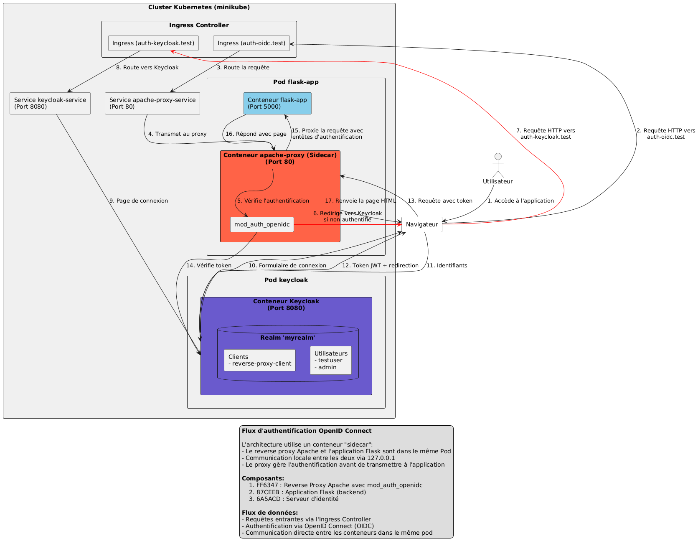

# Kubernetes OIDC Authentication Cluster avec Cilium

Ce projet déploie un cluster Kubernetes avec une application Flask, un reverse proxy Apache pour l'authentification OIDC, et un serveur Keycloak pour la gestion des identités. Cilium est utilisé comme CNI (Container Network Interface) pour la connectivité réseau et la sécurité.

## Architecture

L'architecture comprend :

*   **Application Flask :** Application web principale.
*   **Reverse Proxy Apache :** Déployé en tant que sidecar dans le même pod que Flask, gère l'authentification OIDC.
*   **Keycloak :** Serveur d'identité pour l'authentification et l'autorisation.
*   **Cilium :** Fournit la connectivité réseau entre les composants et implémente les politiques de sécurité.



Le reverse proxy Apache est déployé en tant que sidecar dans le même pod que l'application Flask, permettant une communication directe et sécurisée via localhost (127.0.0.1).

## Cilium

Cilium est une solution CNI open-source qui utilise eBPF pour fournir une connectivité, une sécurité et une observabilité réseau avancées pour les applications cloud-native.

### Avantages de Cilium

*   **Politiques réseau avancées :** Contrôle précis des communications entre services.
*   **Observabilité :** Visibilité détaillée du trafic réseau.
*   **Performance :** Utilisation d'eBPF pour une performance optimale.
*   **Sécurité :** Protection contre les menaces réseau grâce à des politiques granulaires.
*   **Compatible Kubernetes :** S'intègre parfaitement avec l'écosystème Kubernetes.

### Politiques réseau implémentées

Les politiques réseau suivantes sont définies pour sécuriser l'application :

1.  **flask-app-policy.yaml :** Limite l'accès à l'application Flask uniquement depuis le proxy Apache (sidecar).
2.  **keycloak-policy.yaml :** Contrôle l'accès au serveur Keycloak, autorisant uniquement le trafic depuis le proxy Apache.
3.  **ingress-policy.yaml :** Autorise l'accès externe via l'Ingress au proxy Apache sur le port 80.

## Prérequis

*   Minikube v1.35.0 ou ultérieur
*   kubectl v1.29.0 ou ultérieur
*   Interface CLI Cilium

## Installation

1.  Clonez ce dépôt :

    ```bash
    git clone <repo-url>
    cd kube_manifests
    ```
2.  Exécutez le script d'installation :

    ```bash
    ./cilium-setup.sh
    ```

    Ce script automatise les étapes suivantes :

    *   Démarrage de Minikube avec les paramètres appropriés pour Cilium
    *   Installation de l'interface CLI Cilium
    *   Déploiement de Cilium dans le cluster
    *   Application des politiques réseau Cilium

## Vérification de l'installation

Pour vérifier l'état de Cilium :

```bash
cilium status
```

Pour vérifier les politiques réseau :

```bash
kubectl get cnp
```

Pour voir les détails d'une politique spécifique :

```bash
kubectl describe cnp flask-app-policy
```

## Dépannage

### Problèmes courants

1.  **Cilium ne démarre pas correctement**

    ```bash
    kubectl get pods -n kube-system -l k8s-app=cilium
    kubectl logs -n kube-system -l k8s-app=cilium
    ```
2.  **Les politiques ne sont pas appliquées**

    ```bash
    kubectl get cnp -o wide
    ```
3.  **Problèmes de connectivité entre les services**

    *   Vérifier que les politiques autorisent le trafic nécessaire
    *   Utiliser `cilium connectivity test` pour tester la connectivité

### Réinstallation

Si nécessaire, réinstallez Cilium :

```bash
cilium uninstall
./cilium-setup.sh
```

### Autres problèmes

*   **Si Keycloak ne démarre pas correctement :**

    ```bash
    kubectl logs -f $(kubectl get pods -l app=keycloak -o name)
    ```
*   **Si l'ingress ne fonctionne pas correctement :**

    ```bash
    kubectl -n ingress-nginx get pods
    kubectl -n ingress-nginx logs $(kubectl -n ingress-nginx get pods -l app.kubernetes.io/component=controller -o name)
    ```
*   **Si l'authentification échoue :**

    ```bash
    kubectl logs $(kubectl get pods -l app=flask-app -o name) -c apache-proxy
    ```
*   **Si les pods sont bloqués en ImagePullBackOff :**

    ```bash
    minikube image load flask-app:latest
    minikube image load apache-proxy:latest
    kubectl delete pod $(kubectl get pods -l app=flask-app -o name | cut -d/ -f2)
    ```

## Monitoring

Pour surveiller le trafic réseau, vous pouvez activer Hubble (interface d'observabilité de Cilium) :

```bash
cilium hubble enable
```

## Amélioration future

*   Activation de Hubble pour une meilleure observabilité
*   Implémentation de politiques réseau plus détaillées basées sur les URL et les méthodes HTTP
*   Configuration de métriques Prometheus pour le monitoring

## Ressources

*   [Documentation officielle de Cilium](https://docs.cilium.io/)
*   [Guide des politiques réseau Cilium](https://docs.cilium.io/en/stable/network/kubernetes/policy/)
*   [Tutoriels Cilium](https://docs.cilium.io/en/stable/tutorials/)