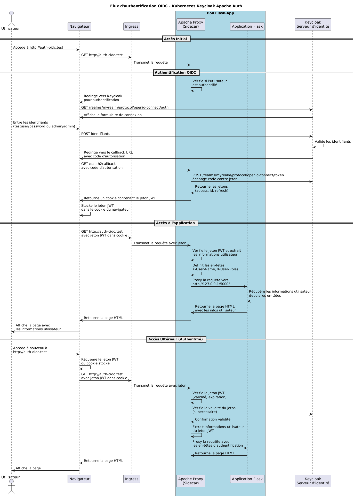

# Kubernetes OIDC Authentication Cluster

Ce projet déploie un cluster Kubernetes avec trois composants principaux :

1. Une application Flask simple
2. Un reverse proxy Apache avec l'authentification OIDC (en sidecar)
3. Un serveur Keycloak pour la gestion des identités

## Architecture

Dans cette architecture, le reverse proxy Apache est déployé en tant que sidecar dans le même pod que l'application Flask. Cela permet une communication directe et sécurisée entre le proxy et l'application.

### Diagramme d'architecture

Le diagramme ci-dessous illustre en détail le flux d'authentification OpenID Connect :



#### Explications du diagramme :

- **Flux d'authentification :** Le diagramme montre le parcours complet d'une requête utilisateur, depuis le navigateur jusqu'à l'application Flask, en passant par l'authentification Keycloak.
- **Pattern Sidecar :** L'application Flask et le reverse proxy Apache sont dans le même pod, communiquant via localhost (127.0.0.1).
- **Composants principaux :**
  - Conteneur Flask (bleu) : Application backend
  - Conteneur Apache (rouge) : Gère l'authentification OIDC
  - Conteneur Keycloak (violet) : Serveur d'identité avec utilisateurs et clients
- **Flux de données :** Les flèches numérotées indiquent l'ordre précis des opérations lors de l'authentification d'un utilisateur.

## Prérequis

- Docker installé
- Minikube installé
- kubectl installé
- Privilèges pour modifier le fichier /etc/hosts

## Configuration

- **Application Flask** : Service web simple qui affiche les informations utilisateur.
- **Reverse Proxy Apache** : Apache avec mod_auth_openidc qui gère l'authentification OIDC, déployé comme sidecar.
- **Keycloak** : Serveur d'identité qui initialise un realm avec des utilisateurs prédéfinis.

## Déploiement complet

### 1. Démarrer Minikube

```bash
# Démarrer minikube
minikube start

# Activer le module ingress pour l'accès externe
minikube addons enable ingress

# Démarrer le tunnel minikube (à garder ouvert dans un terminal séparé)
minikube tunnel
```

### 2. Construire les images Docker

```bash
cd kube_manifests
./build-images.sh
```

### 3. Charger les images dans Minikube

```bash
# Charger les images dans Minikube
minikube image load flask-app:latest
minikube image load apache-proxy:latest
```

### 4. Déployer les services sur Kubernetes

```bash
# Déployer Keycloak
kubectl apply -f keycloak/configmap.yaml
kubectl apply -f keycloak/deployment.yaml
kubectl apply -f keycloak/ingress.yaml

# Attendre que Keycloak soit prêt (cela peut prendre jusqu'à 2-3 minutes)
kubectl wait --for=condition=ready pod --selector=app=keycloak --timeout=180s

# Déployer Apache et Flask
kubectl apply -f reverse-proxy/configmap.yaml
kubectl apply -f application/deployment.yaml 
kubectl apply -f reverse-proxy/service.yaml
kubectl apply -f ingress.yaml
```

### 5. Configurer les entrées DNS

Obtenir l'adresse IP de l'ingress:
```bash
INGRESS_IP=$(kubectl get ingress -o jsonpath='{.items[0].status.loadBalancer.ingress[0].ip}')
echo $INGRESS_IP
```

Ajouter les entrées au fichier /etc/hosts:
```bash
sudo sh -c "echo \"$INGRESS_IP auth-oidc.test\" >> /etc/hosts"
sudo sh -c "echo \"$INGRESS_IP auth-keycloak.test\" >> /etc/hosts"
```

### 6. Vérification du déploiement

Vérifier que Keycloak fonctionne correctement:
```bash
curl -s http://auth-keycloak.test/realms/myrealm/.well-known/openid-configuration | head -5
```

Vérifier que l'application redirige vers Keycloak pour l'authentification:
```bash
curl -s http://auth-oidc.test -I
```

## Accès à l'application

Accédez à l'application via votre navigateur:
```
http://auth-oidc.test
```

Vous serez redirigé vers la page de connexion de Keycloak. Après vous être authentifié, vous serez redirigé vers l'application Flask.

## Utilisateurs par défaut

- **Utilisateur normal** :
  - Nom d'utilisateur : testuser
  - Mot de passe : password
  - Rôle : user

- **Administrateur** :
  - Nom d'utilisateur : admin
  - Mot de passe : admin
  - Rôles : admin, user

## Dépannage

### Si le tunnel Minikube se déconnecte

Si le tunnel Minikube se déconnecte, redémarrez-le dans un terminal séparé:
```bash
minikube tunnel
```

### Si Keycloak n'est pas accessible

Attendre que Keycloak soit complètement initialisé (peut prendre jusqu'à 3 minutes):
```bash
kubectl logs -f $(kubectl get pods -l app=keycloak -o name)
```

### Si l'ingress ne fonctionne pas correctement

Vérifier l'état du contrôleur d'ingress:
```bash
kubectl -n ingress-nginx get pods
kubectl -n ingress-nginx logs $(kubectl -n ingress-nginx get pods -l app.kubernetes.io/component=controller -o name)
```

### Si l'authentification échoue

Vérifier les logs du reverse proxy Apache:
```bash
kubectl logs $(kubectl get pods -l app=flask-app -o name) -c apache-proxy
```

### Si les pods sont bloqués en ImagePullBackOff

Si vous rencontrez des erreurs d'extraction d'image (ImagePullBackOff), assurez-vous que les images sont bien chargées dans Minikube:
```bash
minikube image load flask-app:latest
minikube image load apache-proxy:latest
```

Ensuite, supprimez et laissez Kubernetes recréer le pod:
```bash
kubectl delete pod $(kubectl get pods -l app=flask-app -o name | cut -d/ -f2)
```
